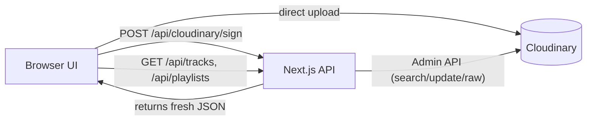

# AnonBeats

Personal, ad‑free music player — upload your songs, build playlists, and stream beautifully.

<p align="left">
  <a href="https://nextjs.org/"></a>
  <a href="https://www.typescriptlang.org/"></a>
  <a href="https://tailwindcss.com/"></a>
  <a href="https://cloudinary.com/"></a>
  <a href="https://vercel.com/"></a>
  <a href="./LICENSE"></a>
</p>

---

## Table of Contents

- [Demo](#demo)
- [Features](#features)
- [Tech Stack](#tech-stack)
- [How it works](#how-it-works)
- [Quick Start](#quick-start)
- [Scripts](#scripts)
- [Environment Variables](#environment-variables)
- [API Endpoints](#api-endpoints)
  - [Tracks](#tracks)
  - [Playlists](#playlists-raw-json-stored-at-anonbeatsmetaplaylistsjson)
  - [Notes](#notes)
- [Customization](#customization)
- [Deployment (Vercel)](#deployment-vercel)
- [Roadmap](#roadmap)
- [License](#license)
- [Contact](#contact)

---

## Demo


> Homepage hero with spotlight, socials bar, and sticky player


> Library grid with covers, hover play, search, add-to-playlist


> Playlists with hero cover, add/search tracks, play all, remove

---

## Features

- Upload your own audio files (MP3/M4A/OGG/FLAC/AAC/WAV)
- Title prompt + optional cover image per upload
- Artwork extraction from embedded ID3 (fallback to your app logo)
- Cloudinary-only backend
  - Audio via video endpoint (proper byte-range seeking)
  - Covers via image endpoint
  - Track metadata stored in asset context (title/artist/album/coverUrl/durationSec)
  - Library fetched via Cloudinary Admin API (fresh context)
  - Playlists stored as a single raw JSON in Cloudinary
- Gorgeous UI (Tailwind + Acenternity style)
- Sticky PlayerBar with seek/prev/next/volume
- Media Session API (system controls)
- Socials bar on the right (GitHub/LinkedIn/Topmate/etc.)

---

## Tech Stack

- Next.js 15 (App Router) + TypeScript
- Tailwind CSS + Framer Motion + Lucide Icons
- Cloudinary (storage, delivery, metadata, raw JSON playlists)
- No separate DB required

---

## How it works



- Upload flow
  1. UI asks server to sign params (folder/tags/context)
  2. Browser uploads audio (`video/upload`) directly to Cloudinary
  3. Optional cover uploads (`image/upload`) or fallback to `/logo.jpeg`
  4. API PATCH writes final context (title/artist/album/coverUrl/durationSec)

- Library flow
  - GET `/api/tracks` lists audio from your folder/tag with fresh context

- Playlists flow
  - Raw JSON at `anonbeats/meta/playlists(.json)` in Cloudinary
  - API reads/writes JSON (create/delete/add/remove)
  - UI fetches tracks + playlists and composes views
 
  ---

## Quick Start

1. Clone and install

```bash
git clone https://github.com/<you>/anonbeats.git
cd anonbeats
npm install
```

2. Environment
Create `.env.local`:
```bash
CLOUDINARY_CLOUD_NAME=your_cloud
CLOUDINARY_API_KEY=your_key
CLOUDINARY_API_SECRET=your_secret
CLOUDINARY_FOLDER=anonbeats/tracks
```

3. Dev
```bash
npm run dev
# http://localhost:3000
```

4. Upload a track on `/upload`
- Enter a title, optionally choose a cover
- Song appears in Library; add to a playlist
- Play from Library or Playlists

---

## Scripts

```bash
npm run dev    # start dev (Turbopack)
npm run build  # production build
npm run start  # run prod server
npm run lint   # lint
```

---

## Environment Variables

| Name                  | Required | Example          | Notes                              |
|----------------------|----------|------------------|------------------------------------|
| CLOUDINARY_CLOUD_NAME | yes      | dxxxxxxxxx       | Your Cloudinary cloud              |
| CLOUDINARY_API_KEY    | yes      | 1234567890       | Admin API key                      |
| CLOUDINARY_API_SECRET | yes      | abcdef...        | Admin API secret (server only)     |
| CLOUDINARY_FOLDER     | yes      | anonbeats/tracks | Where audio files are saved        |

Never commit `.env.local`.

---

## API Endpoints

### Tracks
- POST `/api/cloudinary/sign` → sign upload params (folder/tags/context/public_id)
- GET `/api/tracks` → list fresh audio (Admin API, includes context)
- DELETE `/api/tracks/[...publicId]` → delete asset from Cloudinary (video)
- PATCH `/api/tracks/[...publicId]` → update context  
  - Body: `{ title?, artist?, album?, coverUrl?, durationSec? }`

### Playlists (raw JSON stored at `anonbeats/meta/playlists(.json)`)
- GET `/api/playlists` → list playlists
- POST `/api/playlists` → create `{ name }`
- GET `/api/playlists/:id` → get playlist
- DELETE `/api/playlists/:id` → delete playlist
- POST `/api/playlists/:id/tracks` → add `{ publicId }`
- DELETE `/api/playlists/:id/tracks?publicId=...` → remove track

### Notes
- Next 15 dynamic routes: await `ctx.params` in handlers for `[...segments]`
- Admin API used for fresh context (Search may lag briefly)

---

## Customization

- Brand colors: `tailwind.config.js` (brand palette)
- Default cover: put your logo at `public/logo.jpeg` (used if no art)
- Socials: edit `src/components/SocialsBar.tsx` links array
- Home hero copy: `src/app/page.tsx`

---

## Deployment (Vercel)

- Push to GitHub → "Import Project" on Vercel
- Add env vars in Vercel: `CLOUDINARY_*`
- Build Command: `npm run build`
- Output: `.next`

---

## Roadmap

- Drag-and-drop reordering in playlists
- Inline rename for tracks/playlists
- Queue page and “Up Next”
- PWA + offline caching for selected playlists
- Keyboard shortcuts (Space, J/K, etc.)
- Waveform seek bar (Web Audio API)

---

## License

See the [LICENSE](./LICENSE) file for details.


---

## Contact

- **Meet T-Bot** - [Discover My Work](https://t-bot-blush.vercel.app/)
- **Tushar Bhardwaj** - [Portfolio](https://tushar-bhardwaj.vercel.app/)
- **Connect 1:1** - [Topmate](https://topmate.io/tusharbhardwaj)
- **GitHub:** [TuShArBhArDwA](https://github.com/TuShArBhArDwA)
- **LinkedIn:** [Tushar Bhardwaj](https://www.linkedin.com/in/bhardwajtushar2004/)
- **Email:** [tusharbhardwaj2617@example.com](mailto:tusharbhardwaj2617@example.com)
